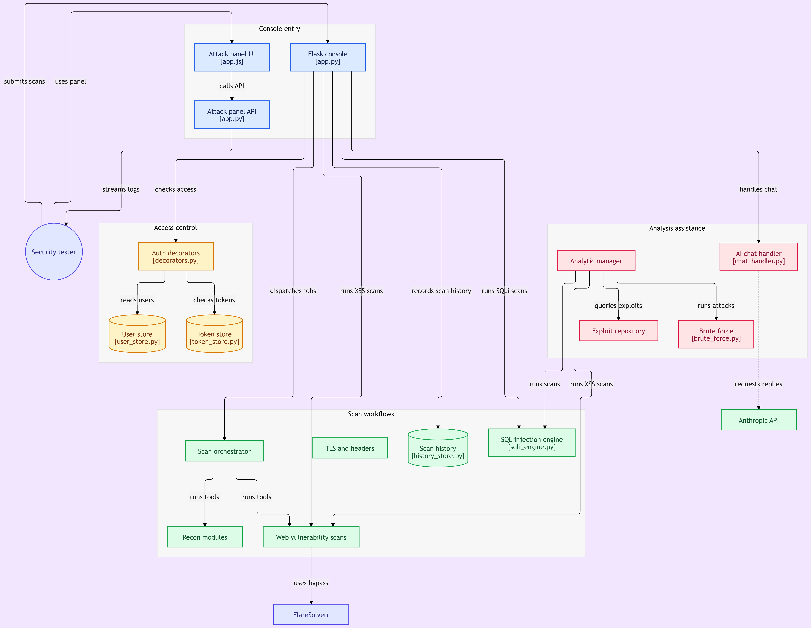

# Emergens

<p align="center">
  
</p>

<p align="center">
  <strong>Field Intelligence Console for Authorized Security Testing</strong>
</p>

<p align="center">
  Reconnaissance, asset intelligence, scan orchestration, and operational visibility in one focused workspace.
</p>

<p align="center">
  <a href="https://github.com/sollxfim-lab/Emergens"></a>
  
  
  <a href="LICENSE"></a>
</p>

> [!WARNING]
> ## Authorized use only
> Emergens is intended exclusively for systems, networks, and applications that you own or have explicit written permission to assess. Do not use it for unauthorized access, disruption, evasion, or any activity outside your approved scope.

## Overview

Emergens is a modular field-intelligence and assessment console designed for security researchers, defenders, and authorized testing teams. It combines reconnaissance, scan orchestration, reporting, and operational visibility into a single workspace.

The project includes:

- Flask web application and dashboard
- API-driven modules and service interfaces
- Local terminal launcher for interactive workflows
- Recon and security-testing modules
- Logging, data storage, and local runtime state
- Optional AI and integration hooks

## Architecture

<p align="center">
  
</p>

<p align="center">
  <em>Emergens component structure and artifact flow</em>
</p>

At a high level, Emergens is organized around:

- **Web application** — the dashboard, API endpoints, templates, and static assets.
- **Core services** — configuration, logging, orchestration, authentication, and shared utilities.
- **Modules** — focused reconnaissance and security-testing capabilities.
- **Artifacts** — logs, wordlists, proxy data, scan output, and local application state.
- **Optional integrations** — AI, messaging, database, and external service connectors.

## Highlights

- Unified operator workspace for web and terminal workflows
- Modular architecture for add-on capabilities
- Reconnaissance for DNS, hosts, services, HTTP, and technology discovery
- Orchestration of scan jobs and module execution
- Structured reporting and result review
- Local runtime logs and stateful artifacts
- Optional AI-assisted workflows and external integrations
- Local Python and Docker deployment support
- Cross-platform compatibility for Linux, macOS, and Windows

## Project status

The repository is a Python-first project with a strong web UI layer and a broad set of scan/recon modules. The current codebase includes:

- Python application code for Flask app, launcher, and orchestration
- HTML/CSS/JS templates for the dashboard and UI
- Modules for recon, scanning, brute-force, SQLi/XSS checks, and related workflows
- Local data stores and supporting proxy/wordlist resources

## Requirements

- Python 3.11+
- `pip` and `venv` or conda
- Git
- Docker and Docker Compose (optional, for containerized deployment)
- Network access only to systems in your approved scope

For full functionality, some modules may require additional dependencies or optional system packages.

## Quick start

### Option A — Local Python environment

```bash
git clone https://github.com/sollxfim-lab/Emergens.git
cd Emergens

python3 -m venv .venv
source .venv/bin/activate          # Linux/macOS
# .venv\Scripts\activate         # Windows PowerShell

python -m pip install --upgrade pip
python -m pip install -r requirements.txt
python app.py
```

The default application port is configured in `config.py` as `3052` unless overridden by environment variables.

Open the app in your browser:

```text
http://127.0.0.1:3052
```

### Option B — Conda environment

```bash
conda env create -f environment.yml
conda activate emergens-ci
python app.py
```

### Option C — Docker

```bash
docker compose up --build
```

Or build manually:

```bash
docker build -t emergens .
docker run --rm -p 3052:3052 emergens
```

## Configuration

Keep deployment-specific settings outside source control whenever possible.

Key configuration points:

- `config.py` centralizes environment-driven settings
- `config.json` is available for local configuration
- Writes are directed to `instance/` by default
- Vercel compatibility is supported by switching writable state to `/tmp`

Environment variables that may be used include:

- `PORT`
- `SECRET_KEY`
- `USERS_DB_PATH`
- `HISTORY_DB_PATH`
- `CHAT_DB_PATH`
- `ANTHROPIC_API_KEY`
- `DEEPSEEK_API_KEY`
- `DEEPSEEK_BASE_URL`
- `TELEGRAM_BOT_TOKEN`
- `VERCEL`

Never commit credentials, private keys, production data, or sensitive scan output to the repository.

## Usage principles

Emergens includes both passive and active testing capabilities. Use the tool responsibly:

- Test only assets explicitly listed in your authorization document.
- Prefer passive collection and low-impact validation before intrusive checks.
- Obtain written approval before testing authentication, injection, file access, brute forcing, or availability-sensitive functionality.
- Do not use amplification, disruption, tampering, evasion, or third-party proxy infrastructure against systems you do not control.
- Stop immediately when a test causes instability or unexpected impact.
- Preserve evidence responsibly and redact secrets or personal data from reports.

This project is not intended to provide attack recipes or disruption guidance.

## Repository structure

```text
Emergens/
├── .flake8
├── CHANGELOG.md
├── Dockerfile
├── LICENSE
├── README.md
├── app.py
├── config.json
├── config.py
├── docker-compose.yml
├── environment.yml
├── requirements.txt
├── terminal.py
├── vercel.json
├── wsgi.py
├── __pycache__/
├── ai_chat/
├── api/
│   └── index.py
├── auth/
├── brute-force-text/
├── core/
├── data/
│   ├── http_logs/
│   └── takeover_state/
├── files/
│   ├── proxies/
│   ├── referers.txt
│   └── useragent.txt
├── instance/
├── logs/
├── modules/
│   ├── __init__.py
│   ├── _common.py
│   ├── analytic_manager.py
│   ├── brute_force.py
│   ├── connectivity_check.py
│   ├── dirfuzz.py
│   ├── dns_lookup.py
│   ├── downsea.py
│   ├── email_security.py
│   ├── exploit_repository.py
│   ├── fixes.py
│   ├── git_scraper_wordlist.py
│   ├── headers_check.py
│   ├── ip_info.py
│   ├── lfi_rfi.py
│   ├── port_scan.py
│   ├── quick_menu.py
│   ├── scan_apikey.py
│   ├── scan_orchestrator.py
│   ├── scan_school.py
│   ├── search_user.py
│   ├── sniper.py
│   ├── source_viewer.py
│   ├── sql_injection.py
│   ├── sql_map.py
│   ├── sqli_engine.py
│   ├── ssl_check.py
│   ├── subdomain_enum.py
│   ├── subdomain_takeover.py
│   ├── tech_fingerprint.py
│   ├── telegram.py
│   ├── whois_lookup.py
│   ├── xss.py
│   └── xss_exploiter.py
├── porttxt/
├── proxy/
│   ├── http.txt
│   ├── meta.json
│   ├── proxies.txt
│   ├── socks4.txt
│   └── socks5.txt
├── static/
├── templates/
│   ├── css/
│   ├── img/
│   ├── js/
│   ├── artifact-structure.png
│   ├── dashboard.html
│   ├── docs.html
│   ├── favicon-180.png
│   ├── favicon-32.png
│   ├── favicon.ico
│   ├── get-started.html
│   ├── login.html
│   ├── logo.png
│   ├── privacy.html
│   ├── remote_access.html
│   ├── status.html
│   ├── terms.html
│   └── webps.html
├── wordlist/
└── ... runtime and generated artifacts
```

### Directory overview

- `api/` — API endpoints and service interfaces
- `auth/` — authentication and access-related logic
- `core/` — orchestration, utilities, and shared runtime components
- `modules/` — reconnaissance and scanner modules
- `templates/` — HTML dashboard and UI files (including `artifact-structure.png`)
- `static/` — front-end assets
- `data/` — runtime state, logs, and artifacts
- `files/` — supporting wordlists, referers, user agents, and proxy-related data
- `logs/` — application logs
- `proxy/` — proxy lists and metadata
- `wordlist/` — enumerations and custom wordlists
- `instance/` — local database and persistence state
- `ai_chat/` — AI-related integration layer

## Running and launch flow

The project supports multiple entry points:

```bash
python app.py
python terminal.py
```

The terminal launcher includes a module-resolution/bootstrap flow and can be useful for diagnosing missing or incompatible modules.

```bash
python terminal.py --diagnose
python terminal.py --version
python terminal.py --help
```

## Troubleshooting

### The application does not start

- Confirm Python 3.11+ is active: `python --version`
- Recreate the virtual environment and reinstall dependencies
- Check `logs/` and terminal output for the first reported error
- Verify the configured port is free

### A module is unavailable

- Install dependencies from `requirements.txt`
- Check module-specific requirements and data files
- Verify any required optional services are running
- Run diagnosis: `python terminal.py --diagnose`

### Docker deployment issues

- Rebuild after dependency changes:

```bash
docker compose build --no-cache
```

- Inspect logs:

```bash
docker compose logs
```

## Development

Contributions are welcome when they improve safety, reliability, maintainability, or authorized defensive testing. Please:

1. Create a focused branch from the default branch.
2. Keep changes small and explain the purpose and impact.
3. Do not add functionality intended to harm, disrupt, evade, or gain unauthorized access.
4. Add tests or reproducible validation where practical.
5. Never include real credentials, private targets, or sensitive scan output.
6. Open a pull request with a clear summary and validation notes.

## Versioning

The repository currently documents a version of `4.4.2` in the project README, while the terminal launcher itself reports a newer runtime version in code. See [`CHANGELOG.md`](CHANGELOG.md) for implementation history and release notes.

## License

Emergens is distributed under the MIT License, subject to the project's authorized-use requirements. See [`LICENSE`](LICENSE) for the complete terms.

## Disclaimer

Emergens is provided for legitimate security research, defensive engineering, and authorized assessment only. The maintainers do not endorse or accept responsibility for unlawful access, disruption, or unauthorized testing.

<p align="center">
  <sub>Built for disciplined security work. Use responsibly.</sub>
</p>
